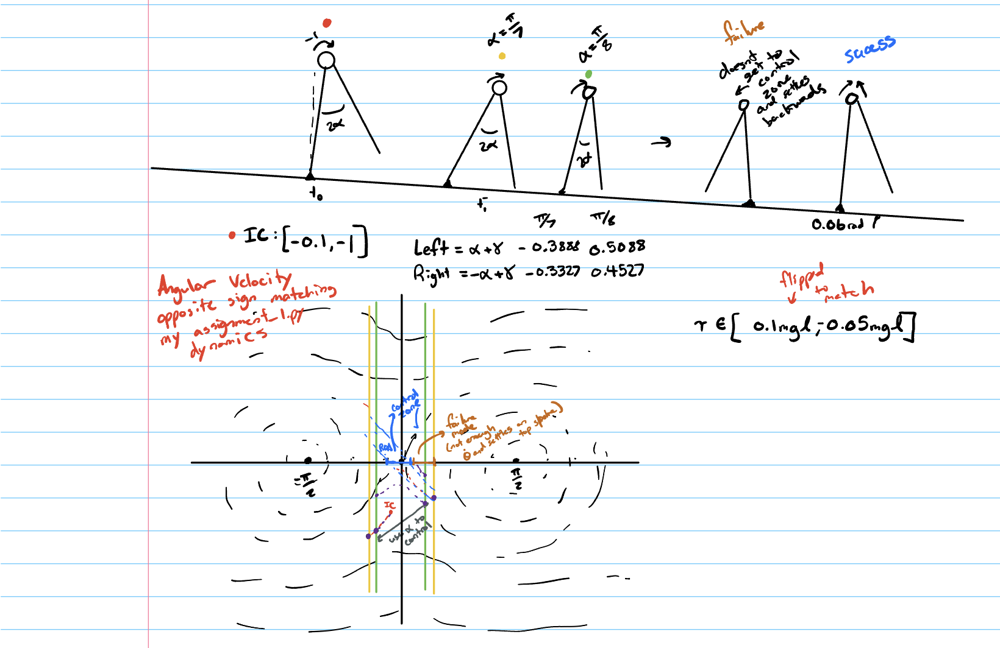

## Assignment 2 Report

## AI Disclaimer
I had worked through about halfway through the assignment by the September 21st class. Professor Heim’s positivity about AI fluency in industry closely matched my experience while working at startups. Over the summer, I used Claude constantly and would often end up in the dark about some of my solutions. I wanted to use this assignment as an opportunity to develop a repeatable process for using AI that I can continue to build on and bring with me after graduation.

For this assignment, I structured my approach and then worked through the assignment using an AI integrated process. I was able to produce a clean solution, but I am not fully happy with it. There were issues with the lookup table and some small logic decisions that were made without my approval, such as unintended tiebreaker logic and two functions that returned graphs of controller dynamics. In my second version, I am going to better implement the workflow from the overall logic down to each function before coding anything and then go function by function, then make it more efficient in the next version. If this approach is still discouraged, please reach out.


## How to Run the code

```bash
git clone https://github.com/jthomforde/MAE5110CodeAssignments.git
```

```bash
cd MAE5110CodeAssignments
```

```bash
git checkout jht224/assignment_2
```

```bash
uv sync --python 3.14
```

Figures are not committed. Each experiment writes its own figure into
`output/assignment_2/`, so run all four before reading the sections below.

```bash
uv run python assignment_2.py --experiment roa
```

```bash
uv run python assignment_2.py --experiment steps
```

```bash
uv run python assignment_2.py --experiment trajectory
```

```bash
uv run python assignment_2.py --experiment animation
```

## Sketch: 



## Region of Attraction


## Poincare Section

In assignment 1 I chose the Poincare section at touchdown. This worked because the angle of
attack was fixed, so the touchdown geometry was constant. In this assignment I chose the
Poincare section at theta = 0, for two main reasons. First, the angle of attack is now a
control input, so the touchdown angle moves every step, while theta = 0 lies outside that
range and every step passes through it. Second, it makes sense physically because the angular velocity at the peak carries the most useful information about the system. If the system reaches its peak with positive angular  velocity, it is guaranteed to finish the step and will not stall.

There are also significant implementation advantages. Trajectories cross it perpendicularly and it is easy to implement because it lines up with our coordinate system.

In my system I calculate the maximum angular velocity at theta = 0 inside the RoA to use as the target for the stepper. This is the approach I first came to in my sketch, and it was the most intuitive both mathematically, since theta = 0 is the point of peak potential energy and minimum angular velocity, and conceptually. 

## Grid Resolution

The grid I verified is the angular velocity axis at the Poincare section. I used a fixed set of 9 possible actions between angle of attack = pi/8 and pi/7. 

After each impact, theta_dot rarely lands on a grid point so I would use the closest grid point. I started at 0.01 spacing between points and doubled it, comparing the steps from 3.0 rad/s IC on the table to the actual walker. Three steps was my reference at 0.01 and I compared it to steps up to spacing = 0.64.

| spacing (rad/s) | table predicts | walker takes | reaches the RoA |
|---|---|---|---|
| 0.64 | 4 | 5 | yes |
| 0.32 | 3 | 4 | yes |
| 0.16 | 3 | 3 | yes |
| 0.08 | 3 | 4 | no |
| **0.04** | **3** | **3** | **yes** |
| 0.02 | 3 | 3 | yes |
| 0.01 | 3 | 3 | yes |


The table alone predicts 3 steps everywhere except for 0.64 so on its own I would pick 0.32. The table treats the walker as sitting exactly on a grid point at every step while the real walker almost never is on a real grid point and accumulates error. I use the walker steps on the table to take this issue into account. 

The generated table shows interesting aspects of the lookup system as well. 0.08 spacing disagrees with my requirements while 0.16 fits. This is because at 0.08 the walker lands on a point in between two grid points and picks the wrong decision while at 0.16 the impacts all fall close to the correct grid points. My requirement is the chosen spacing and all spacings less than it result in matching steps. The coarsest spacing that meets it is 0.04, which is my chosen grid resolution. One step coarser, 0.08, is not good enough becuase the table predicts 3 steps, but the walker takes 4.

I tested from 3.0 rad/s, the same IC as my trajectory plots. I used a single IC because the step count jumps at a few speeds, and near those jumps two grids will always disagree for certain ICs, so the whole map would never agree.

## Steps to Standstill


## Trajectory Requiring at Least 3 Steps

From theta_dot = 3.0 rad/s at theta = 0, the fewest steps to reach the region of attraction is 3 and the most is 5.


## Walker Animation

IC: (0,3)


